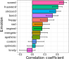
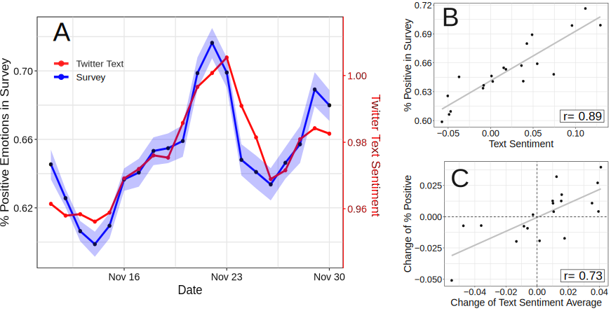
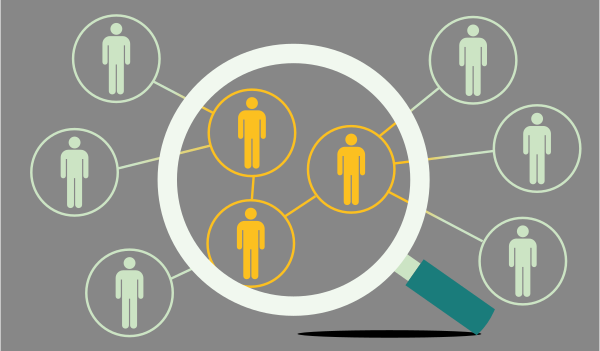

```{r xaringan-themer, include=FALSE, warning=FALSE}
#This block contains the theme configuration for the CSS lab slides style
library(xaringanthemer)
library(showtext)
style_mono_accent(
  base_color = "#5c5c5c",
  text_font_size = "1.5rem",
  header_font_google = google_font("Arial"),
  text_font_google   = google_font("Arial", "300", "300i"),
  code_font_google   = google_font("Fira Mono")
)
```

```{r setup, include=FALSE}
options(htmltools.dir.version = FALSE)
```


layout: true
<div class="my-footer"><span>David Garcia - Inaugural Lecture</span></div> 

---

background-image: url(figures/AboutUS.svg)
background-size: 98%

---

<center>
```{r, echo=FALSE, out.width=900}
knitr::include_graphics("figures/CSSinfo.png")
```
### Aim: understanding human behavior and socio-technical phenomena in the digital society

---

# Outline
</br>
## 1. Methodological Deficits in CSS

## 2. Social Media Macroscopes of Emotions

## 3. Validating a Weekly UK Macroscope

## 4. Validating a Daily Austria Macroscope

---

## *Computational* in Computational Social Science

- **Digital**<br> 
Based on large datasets of human behavior, for example produced by the Web and social media

- **Computerized**<br>
The quantitative analysis of data in an automated, tractable, repeatable, and extensible fashion

- **Generative**<br>
Application of data and results to design of agent-based models that explain complex social phenomena and motivate interventions

[Social Media Data in Affective Science. Max Pellert, Simon Schweighofer and David Garcia. Handbook of Computational Social Science, vol 1 (2022)](https://www.routledge.com/Handbook-of-Computational-Social-Science-Volume-1-Theory-Case-Studies/Engel-Quan-Haase-Liu-Lyberg/p/book/9780367456528)

---

## Strengths and weaknesses of digital trace data

**Strengths:**
- Complementary approach to traditional survey and experimental methods
- Unprecedented scales and granularities
- Ease of data access, replicability of results
- Potentially high external validity, behavior in vivo

**Weaknesses:**
- Limits to internal validity: Lack of counterfactuals hinders causal analysis
- Self-selection bias: Who talks? Normalization issues: Who is silent?
- Data gatekeepers, Twitter as a model organism
- Intractability of black-box predictions and data piñatas

<div style="font-size:15pt">
Bit By Bit: Social Research in the Digital Age. M. Salganik (2017)
</div>

<div style="font-size:15pt">
Meaningful measures of human society in the twenty-first century. D. Lazer et al. (2021)
</div>
---


# Avoid making a data piñata

```{r, echo=FALSE, out.width=1050}
knitr::include_graphics("figures/pinata.png")
```
---
## The Hype Cycle of Computational Social Science
<center>
```{r, echo=FALSE, out.width=900}
knitr::include_graphics("figures/Hype1.svg")
```

---

## The Hype Cycle of Computational Social Science
<center>
```{r, echo=FALSE, out.width=900}

```
---

## The Hype Cycle of Computational Social Science
<center>
```{r, echo=FALSE, out.width=900}
knitr::include_graphics("figures/Hype3.svg")
```

---
background-image: url(figures/VennV2-1.svg)
background-size: 97%
---
background-image: url(figures/VennV2.svg)
background-size: 97%
---

# Social Media Macroscopes of Emotions
</br>
## 1. Methodological Deficits in CSS

## *2. Social Media Macroscopes of Emotions*

## 3. Validating a Weekly UK Macroscope

## 4. Validating a Daily Austria Macroscope
---


# Social Media Macroscopes

```{r, echo=FALSE, out.width=800, fig.align='center'}
knitr::include_graphics("figures/earth.svg")
```

---

layout: true
<div class="my-footer"><span>
<a href=https://arxiv.org/abs/2107.13236> Social media emotion macroscopes reflect emotional experiences in society at large. David Garcia, Max Pellert, Jana Lasser, Hannah Metzler. https://arxiv.org/abs/2107.13236 (2021)</a></span></div>

---

# Social Media Macroscopes of Emotions

.pull-left[
```{r, echo=FALSE, out.width=1100}
knitr::include_graphics("figures/Macy.jpg")
```
<font size="5">
<a href="https://science.sciencemag.org/content/333/6051/1878/"> Diurnal and seasonal mood vary with work, sleep, and daylength across diverse cultures. Golder & Macy, Science (2011) </a>
</font>
]

.pull-right[
```{r, echo=FALSE, out.width=1100}
knitr::include_graphics("figures/hedonometer.png")
```

<font size="5">
<a href="https://journals.plos.org/plosone/article?id=10.1371/journal.pone.0026752"> Temporal patterns of happiness and information in a global social network: Hedonometrics and Twitter. Dodds et al. PLoS One (2011) </a>
</font>
]

---

## Examples of social media emotion macroscopes
.pull-left[
```{r, echo=FALSE, out.width=500}
knitr::include_graphics("figures/Paris.png")
``` 
<font size="5"> <a href="https://journals.sagepub.com/doi/full/10.1177/0956797619831964"> Collective Emotions and Social Resilience in the Digital Traces After a Terrorist Attack. Garcia & Rime, Psychological Science (2019) </a>
</font>
]

.pull-right[
```{r, echo=FALSE, out.width=1100}
knitr::include_graphics("figures/COVID.png")
```

<font size="5">
<a href="https://psyarxiv.com/qejxv"> Collective Emotions During the COVID-19 Outbreak. Metzler et al. Psyarxiv (2021) </a>
</font>
]

---


## Limits of Social Media Data to Study Emotion

```{r, echo=FALSE, out.width=1100}
knitr::include_graphics("figures/Jaidka.png")
```

[Estimating geographic subjective well-being from Twitter: A comparison of dictionary and data-driven language methods. Jaidka et al. PNAS (2020)](https://www.pnas.org/content/117/19/10165.short)


---

## When the micro and macro level might not match

.pull-left[
```{r, echo=FALSE, out.width=500}
knitr::include_graphics("figures/earth.svg")
``` 
]

.pull-right[
Concerns about macroscopes:
1. Representation issues

2. Performative behavior

3. Measurement error and bias

4. Researcher degrees of freedom
]

[Social Media Data in Affective Science. Max Pellert, Simon Schweighofer and David Garcia. Handbook of Computational Social Science, vol 1 (2022)](https://www.routledge.com/Handbook-of-Computational-Social-Science-Volume-1-Theory-Case-Studies/Engel-Quan-Haase-Liu-Lyberg/p/book/9780367456528)

---


# Validating a Weekly UK Macroscope
</br>
## 1. Methodological Deficits in CSS

## 2. Social Media Macroscopes of Emotions

## *3. Validating a Weekly UK Macroscope*

## 4. Validating a Daily Austria Macroscope

---
# Validating a UK emotion macroscope

```{r, echo=FALSE, out.width=975, fig.align='center'}
knitr::include_graphics("figures/MacroTest2.svg")
```

---

# Data to test the macroscope

```{r, echo=FALSE, out.width=1100, fig.align='center'}
knitr::include_graphics("figures/Data.svg")
```

- Text analysis: dictionary-based (LIWC) and supervised (RoBERTa)
- Gender-rescaled time series of emotional expression
- Pre-registered hypotheses with prediction period from Nov 2020
---

# Sadness in Twitter and YouGov

```{r, echo=FALSE, out.width=1200, fig.align='center'}
knitr::include_graphics("figures/Sadness.svg")
```

- Similar results with dictionary-based and supervised methods (r~0.65)
---
# Anxiety in Twitter and YouGov

```{r, echo=FALSE, out.width=1200, fig.align='center'}
knitr::include_graphics("figures/Anxiety.svg")
```

- Improvement thanks to gender information in tweets

---
# Joy in Twitter and YouGov

```{r, echo=FALSE, out.width=1200, fig.align='center'}
knitr::include_graphics("figures/Joy.svg")
```

- Good correlation with supervised method but no correlation with dictionary-based method


---
# Overview of results

```{r, echo=FALSE, out.width=1200, fig.align='center'}

```

- Consistent results for both methods in sadness
- Similar for anxiety except for the classifier in the prediction period
- LIWC positive largely fails: lexicon is too general
- Joy supervised classifier has similar correlation as negative classifiers
---

# Exploring 12 emotional states
.pull-left[

- Time series of number sentences like "I am [emotion]" on Twitter

- Weak correlations happen for infrequent emotions in text

- Comparison: US weekly pre-election polls correlate with 0.66

- Arxiv preprint at https://arxiv.org/abs/2107.13236

]

.pull-right[
```{r, echo=FALSE, out.width=700}

```
]

---

layout: true
<div class="my-footer"><span>
Validating daily social media macroscopes of emotions. Max Pellert, Hannah Metzler, Michael Matzenberger, David Garcia. Scientific Reports (Forthcoming)</span></div>

---


#  Validating a Daily Austria Macroscope
</br>
## 1. Methodological Deficits in CSS

## 2. Social Media Macroscopes of Emotions

## 3. Validating a Weekly UK Macroscope

## *4. Validating a Daily Austria Macroscope*

---

# Austrian macroscope in Der Standard

.pull-left[

- 20-day emotion survey in derstandard.at (N=268,128)
- Daily frequency, 3-day windows

- Text from Der Standard forum (N=452,013)

- Austrian tweets (N=515,187) filtered as UK macroscope

- Compared dictionary-based (LIWC) and supervised model (GS)

]
.pull-right[
```{r, echo=FALSE, out.width=450}

```
]

---

## Survey emotions and Der Standard sentiment

```{r, echo=FALSE, out.width=1000, fig.align='center'}
knitr::include_graphics("figures/DerStandardResult.png")
```

---

## Survey emotions and Twitter sentiment

```{r, echo=FALSE, out.width=1000, fig.align='center'}

```

---


## Testing various configurations

```{r, echo=FALSE, out.width=1000, fig.align='center'}
knitr::include_graphics("figures/DerStandardCorrs.png")
```


---

# Correlations with new COVID-19 cases

.pull-left[
```{r, echo=FALSE, out.width=600}
knitr::include_graphics("figures/DS31.svg")
```
]
.pull-right[
```{r, echo=FALSE, out.width=600}
knitr::include_graphics("figures/DS32.svg")
```
]

- Do correlations attenuate due to additional social media measurement error?
- Survey emotion correlation with new cases as strong as Twitter sentiment
- Errors sources might be different: Need for conceptual validations

---

## Online Media for Social Sensing of Emotions?

```{r, echo=FALSE, out.width=850, fig.align='center'}

```

---

## Social media macroscopes: Take-home message

```{r, echo=FALSE, out.width=950, fig.align='center'}
knitr::include_graphics("figures/summary2.svg")
```

**Despite important concerns about Computational Social Science methods in terms of representativity and online behavior, social media macroscopes of emotion can substantially agree with established social science methods**

---

# Summary

- **Computational Social Science and methods validation**
- **Questions about social media macroscopes of emotions**
- **Validation in the UK with Twitter**
- **Validation in Austria with Der Standard**

<a href=https://arxiv.org/abs/2107.13236> Social media emotion macroscopes reflect emotional experiences in society at large. David Garcia, Max Pellert, Jana Lasser, Hannah Metzler. (2021)

<a href=https://arxiv.org/abs/2108.07646> Validating daily social media macroscopes of emotions. Max Pellert, Hannah Metzler, Michael Matzenberger, David Garcia. Scientific Reports (Forthcoming)


.center[**More at: [www.dgarcia.eu](https://dgarcia.eu) and [@dgarcia_eu](https://twitter.com/dgarcia_eu)**  

#Thanks for listening!

]
